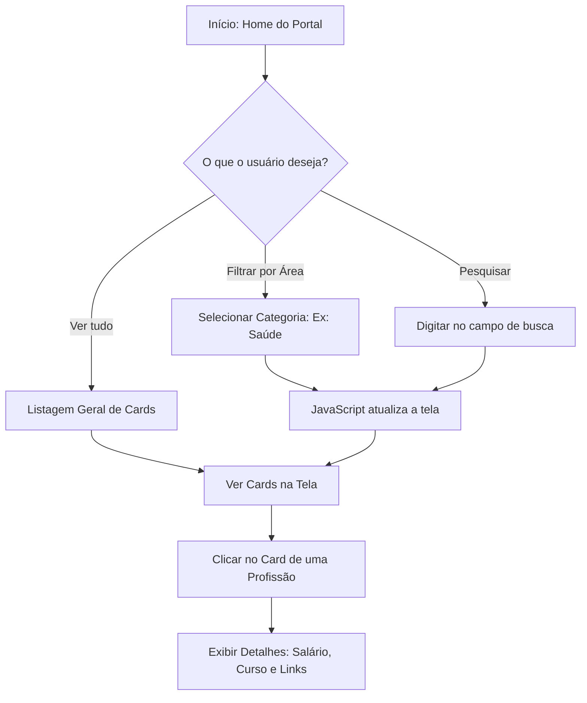
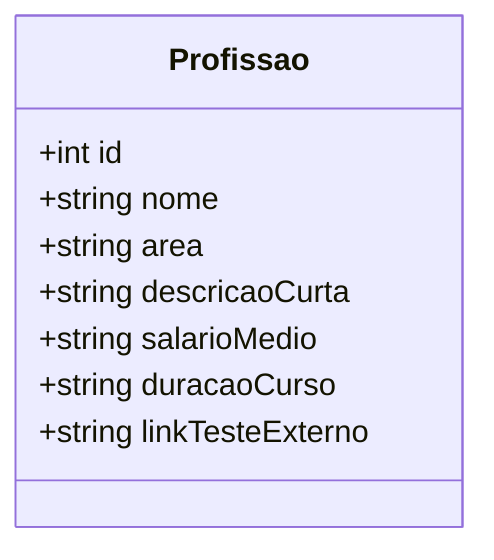

# Relatório de Arquitetura e Modelagem - Portal Futuro

Este documento apresenta o fluxo de navegação do usuário e a estrutura lógica dos dados consumidos pela aplicação web.

## 1. Diagrama de Fluxo do Usuário (Navegação)
O fluxograma abaixo descreve a jornada do estudante ao interagir com a interface do portal para encontrar uma profissão.

## 2. Modelo Técnico de Dados (Simulação de Objetos JS)
Como o projeto não utiliza banco de dados relacional (SQL) nesta etapa, a persistência e renderização dos dados de cada profissão serão estruturadas via Array de Objetos JSON no arquivo `script.js`.

-- **Link para o Trello:** https://trello.com/b/7JY2MqC5/trello-portal-futuro-flavia
